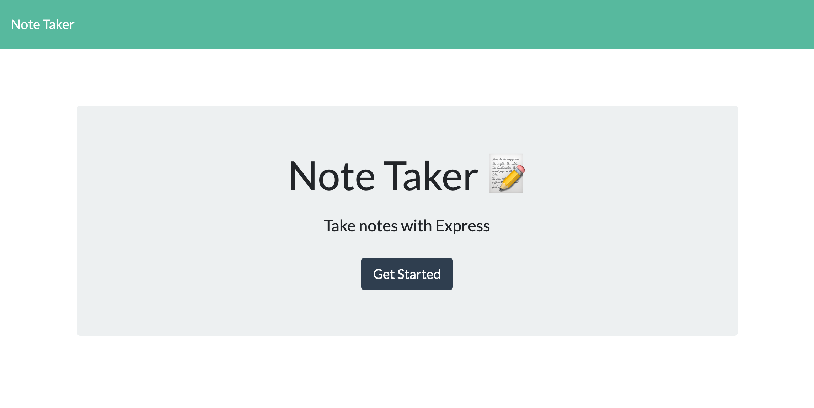
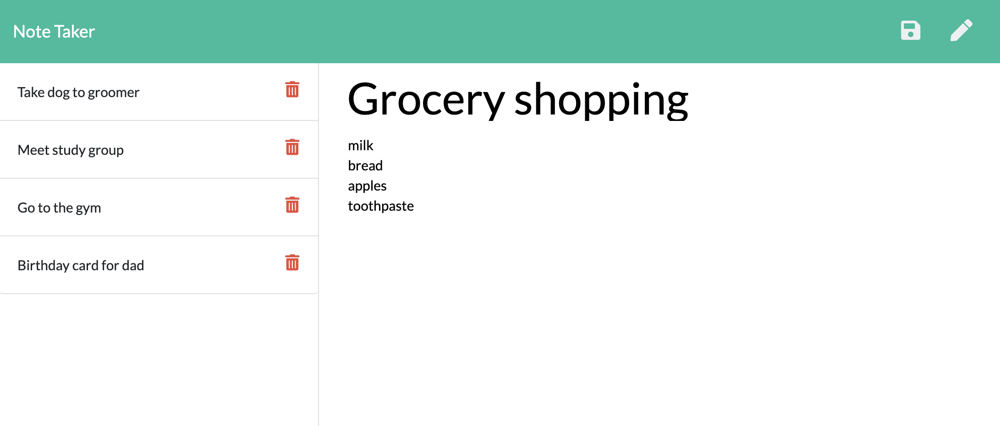

# Unit 11 Express Homework: Note Taker

## Description

This is a [node](https://nodejs.org/en/) application that can be used to write, save, and delete notes. It uses [express](https://expressjs.com/) on the backend to save and retrieve note data from a JSON file  named `db.json`. It uses [ajax](https://api.jquery.com/jquery.ajax/) to make the service calls. The frontend code for this was provided, and the server routes were added to make the application functional.

## HTML routes:

  * GET `/notes` - returns the `notes.html` file.

  * GET `*` - returns the `index.html` file

## API routes:

  * GET `/api/notes` - reads the `db.json` file and returns all of the saved notes as JSON. It returns `0` if no notes are found.

  * POST `/api/notes` - recieves a new note to save on the request body, adds it to the `db.json` file with a unique id, and returns the new note as JSON in the format `{"id": value(int), "title": value(string), "text: value(string)}`.

  * DELETE `/api/notes/:id` - recieves a query paramter containing the id of a note to delete. It reads all of the data from the `db.json` file, removes the note with the given `id` property, and then rewrites the notes back to the `db.json` file.

# Deployed App

The app is deployed at this URL: https://limitless-ravine-02381.herokuapp.com/

# Steps to run the Application Locally

1. Download the application from GitHub
2. Type `node server.js` into the terminal
3. Open `localhost:3000` in your browser. This will show the application's main page.

# Main Page

* Click `Get Started` to go to the note taking page

# Note Taker Page

* In the right pane, click on `Note Title` to enter the title of a note, and `Note Text` to enter the text of the note. Click on the disk (`Save`) icon to save your note. Click the pen icon to clear the note writing fields so you can enter a new note (this will clear a note that has not been saved without saving it).

* The note titles are shown in the left pane. Click on a note title to display the full text of the note in the right pane. Click on the trash icon to delete a note.

* Click `Note Taker` in the header to return to the main page.
